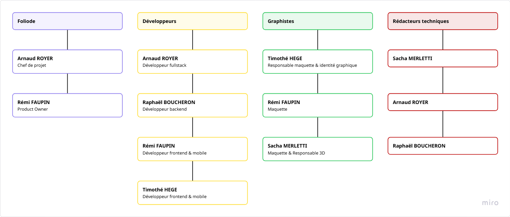
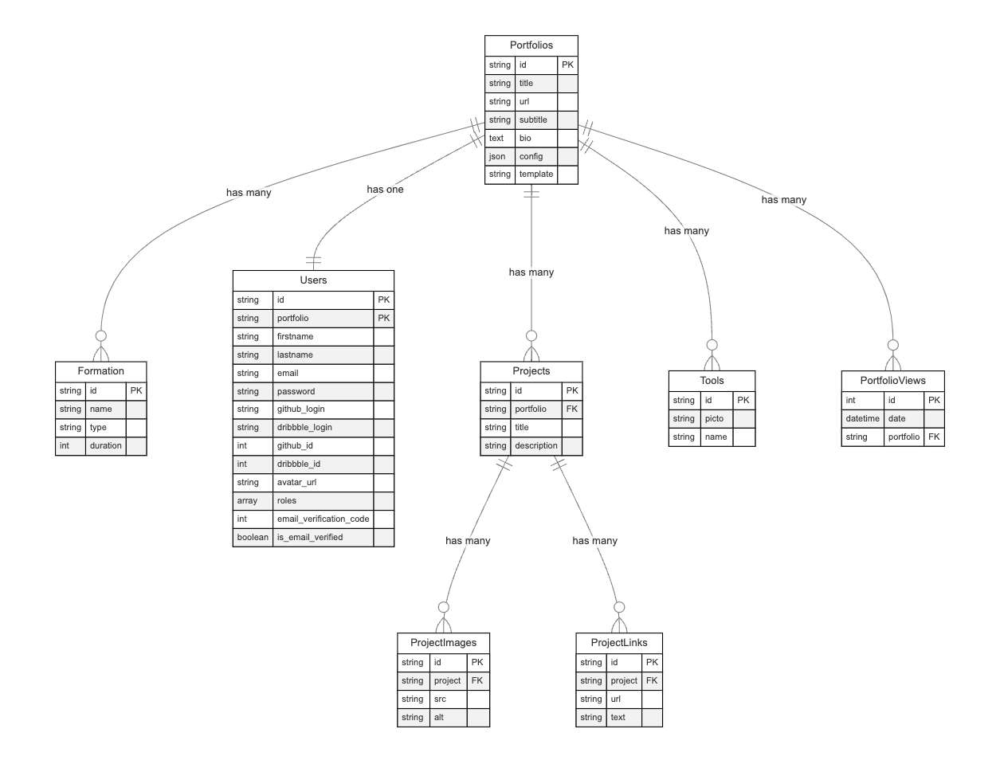

# Foliode

Le projet **Foliode** a pour mission de concevoir et développer une solution technologique orientée vers les étudiants. Foliode permet aux utilisateurs de générer et personnaliser un portfolio web professionnel, mettant en valeur les compétences et les projets de l'étudiant.

## Sommaire

1. [Description du Projet](#description-du-projet)
1. [Technologies et Stack](#technologies-et-stack)
1. [Phase de Cadrage](#phase-de-cadrage)

## Description du Projet

**Foliode** est un générateur de portfolios pédagogiques conçu pour simplifier la création de portfolios en ligne professionnels et accessibles. Cet outil vise à :

- Offrir aux étudiants une plateforme de présentation de leurs compétences et projets dans un format visuel et accessible.
- Faciliter la personnalisation des portfolios en fonction des préférences et des compétences de l'étudiant.
- Permettre aux étudiants de présenter leur portfolio à des recruteurs potentiels.

Les utilisateurs sont guidés étape par étape à travers un formulaire intuitif, peuvent choisir parmi différents templates de présentation, et génèrent un portfolio final hébergé sous un sous-domaine unique (ex. : `username.foliode.com`).

### Critères Pédagogiques

- **Développement Front-end** : Création d’interfaces utilisateurs (UI/UX) et conception de pages web interactives.
- **Développement Back-end** : Infrastructure sécurisée pour la gestion des données et les interactions avec la base de données.
- **Création numérique et dispositifs interactifs** : Modélisation 3D, production d'images, et intégration de dispositifs visuels.
- **Développement d’une application mobile** : Adaptabilité et accessibilité multi-supports.
- **Déploiement, sécurité et hébergement** : Mise en production et gestion sécurisée des sous-domaines utilisateurs.

### Diagramme Use Case

## Technologies et Stack

- **Frontend** : Next, React (TypeScript), Tailwind, Docker.
- **Backend** : Symfony, PostgreSQL, Docker.
- **Dispositifs Interactifs** : Blender, Three.js pour la modélisation et l’affichage 3D.
- **Design** : Suite Adobe, Figma pour la création visuelle et les maquettes.

## Phase de Cadrage

### Membres de l'Équipe

- **Arnaud ROYER**
- **Timothé HEGE**
- **Rémi FAUPIN**
- **Raphaël BOUCHERON**
- **Sacha MERLETTI**

Chef de projet & Scrum Master : **Arnaud ROYER**
Product Owner : **Rémi FAUPIN**

Nom de l'équipe : **Foliode**

### Répartition des Rôles

Vous pouvez accéder à notre Jira en cliquant [**ici.**](https://foliode.atlassian.net/jira/software/projects/DEV/boards/1)

### Architecture du site

---

#### Modèle MVC (image cliquable)

---

#### Modèle Physique des Données

---

#### Diagramme de Classes

---

---

#### Structures d'URL

Foliode utilisera un système de sous-domaine dynamique :

1. `www.foliode.com` : Les pages de présentations.

2. `app.foliode.com` : Tout ce qui va toucher à l'application de création du portfolio.
    - Connexion / Inscription
    - Formulaire guidé
    - Dashboards
    - Liste des templates
    - Configuration portfolio
    - Gestion du compte utilisateur

3. `username.foliode.com` : Hébergement du portfolio de l'utilisateur.

---

#### Menus de navigation

1. `www.foliode.com` : À propos, contact, se connecter, s'inscrire

2. `app.foliode.com` : Mon compte, mon portfolio, mes compétences, mes projets, paramètres, se déconnecter

---

#### Charte graphique

---

#### UI/UX

Vous pouvez suivre la partie design UI/UX à partir de [**ce lien (Figma).**](https://www.figma.com/design/ROWwLlIORy6RhrFvcYBhvL/Foliode?node-id=0-1&node-type=canvas&t=nkLLfDURPWkMKEpb-0)

---

#### Carte mentale (image cliquable)

---

#### Repository

Vous pouvez suivre l'avancement de notre projet à partir de [**ce repository GitHub.**](https://github.com/itsarnaud/Foliode)